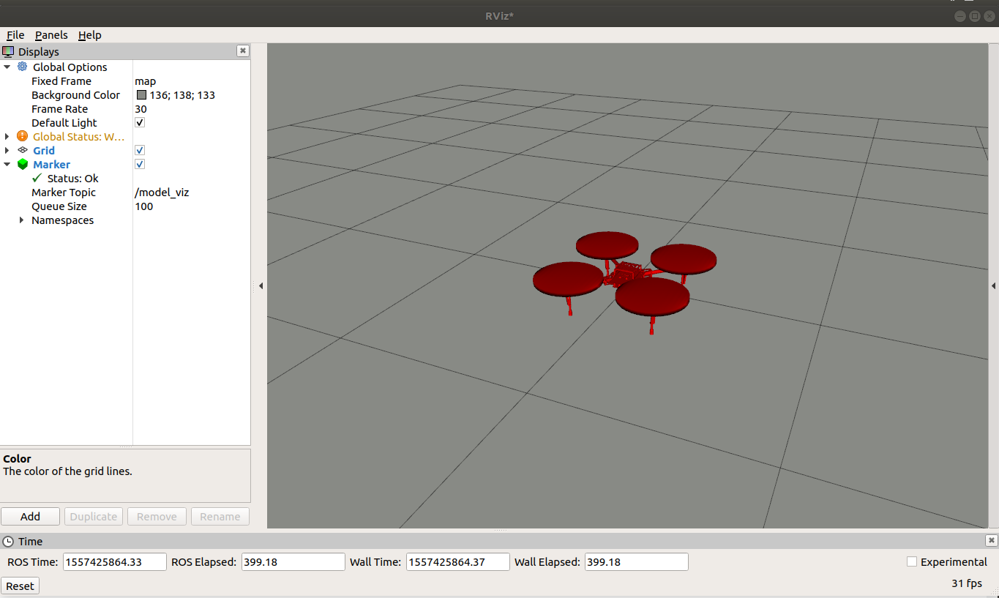

# Model Publisher

This package contains a node that publishes a mesh model in a set tf frame. The model is published at 0, 0, 0 in this frame with no rotation. The model filename, tf frame id, color and scale are launch file parameters. The model_publisher.launch file in the launch/ directory shows an example of how to run the node.

Author: John Keller
slack: kellerj
email: jkeller2@andrew.cmu.edu